# Clickstream task

**_Basic Kafka operations._**
  + _CREATE A TOPIC TO STORE YOUR EVENTS_ 
  + _WRITE SOME EVENTS INTO THE TOPIC_
  + _READ THE EVENTS_

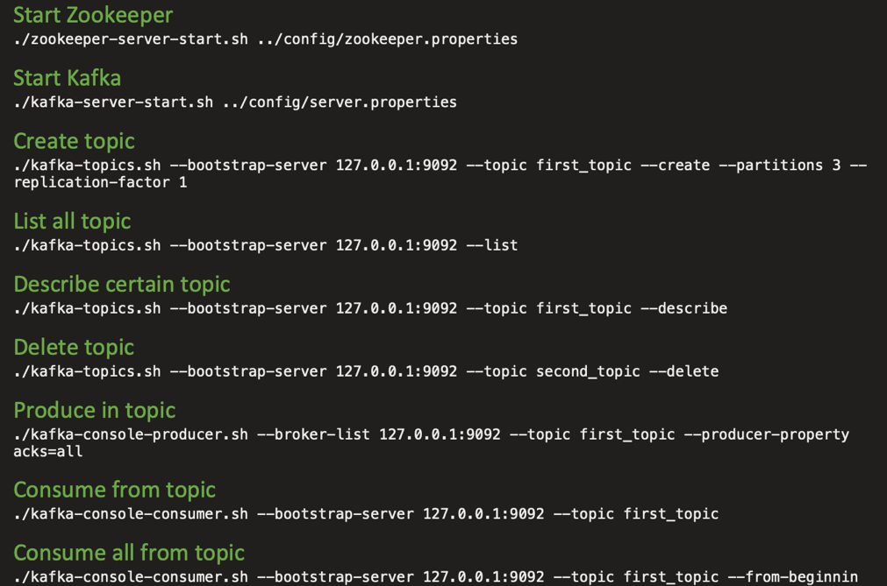

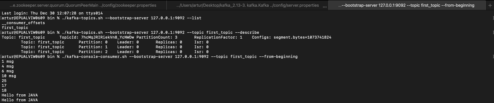

_**Download and run the tutorial. Proceed through all steps. Make a screenshot of results.**_

_Notice, in case of MacOS, You need to provide some modifications in scripts_:
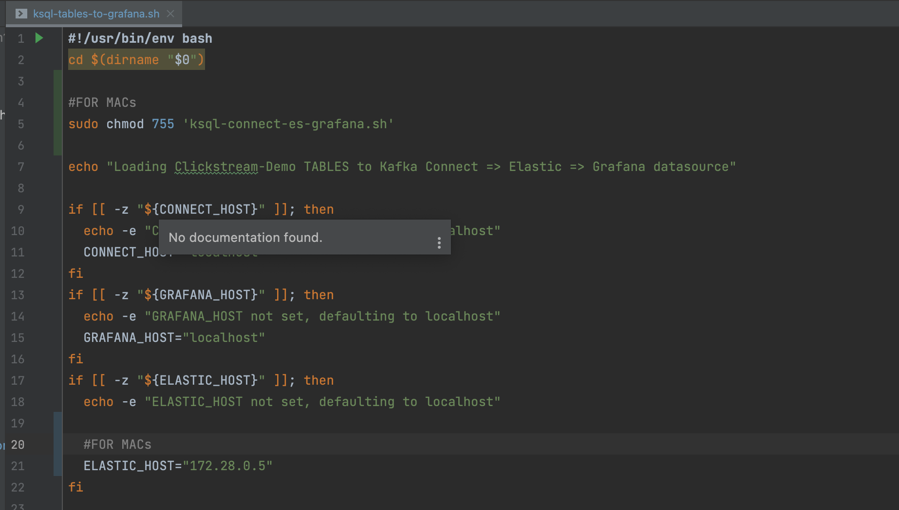

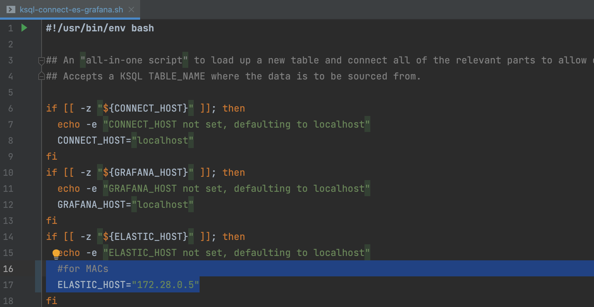

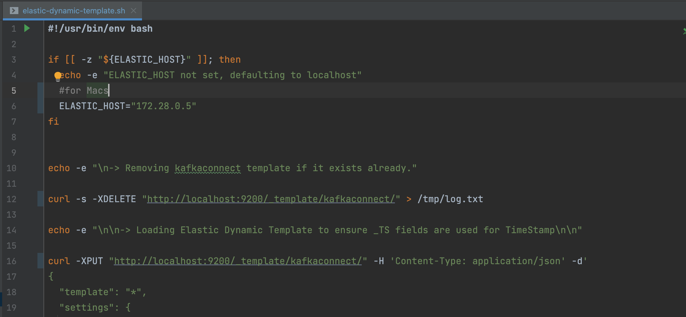

**RESULTS**

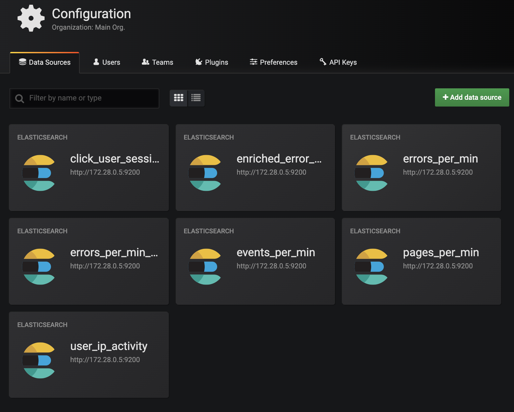

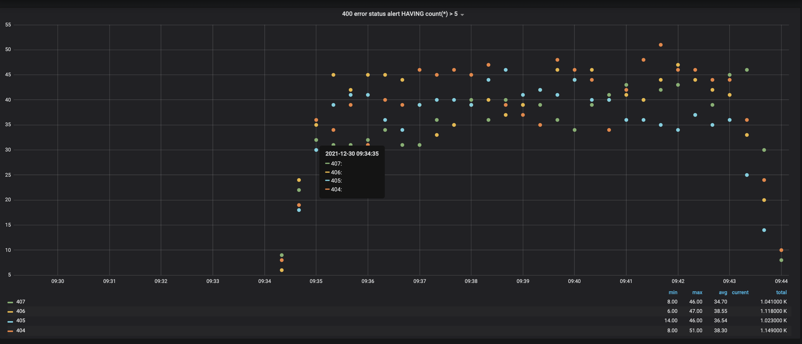

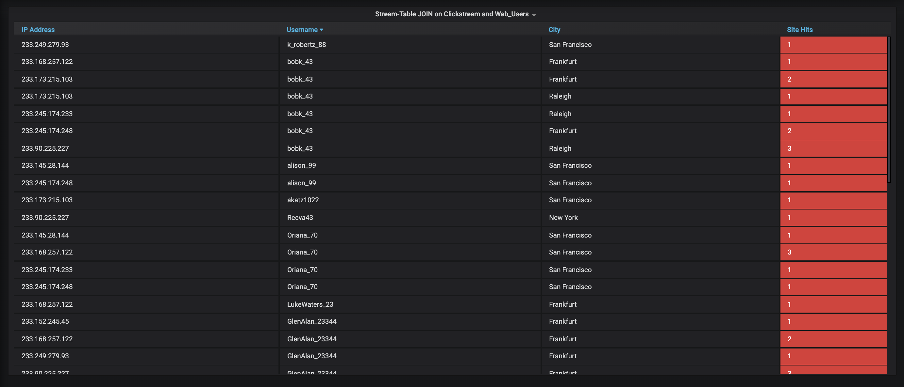

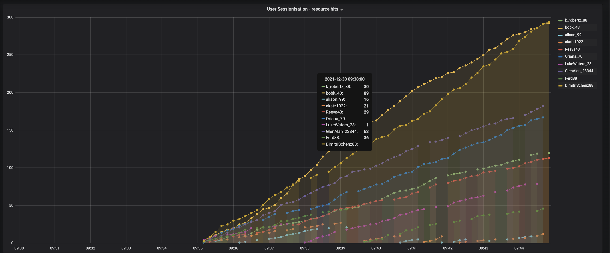

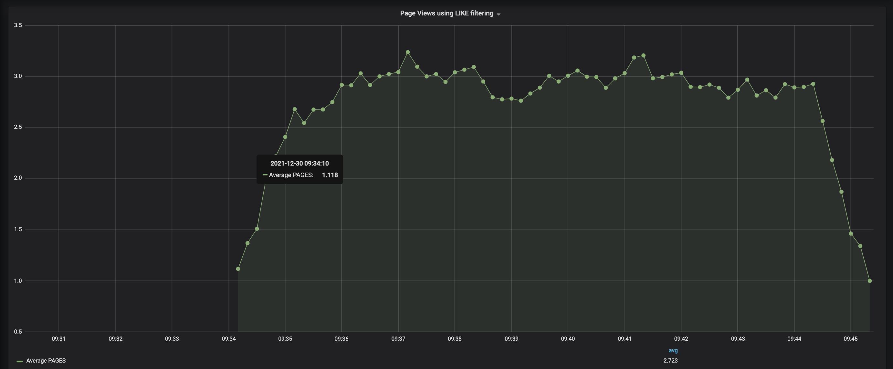

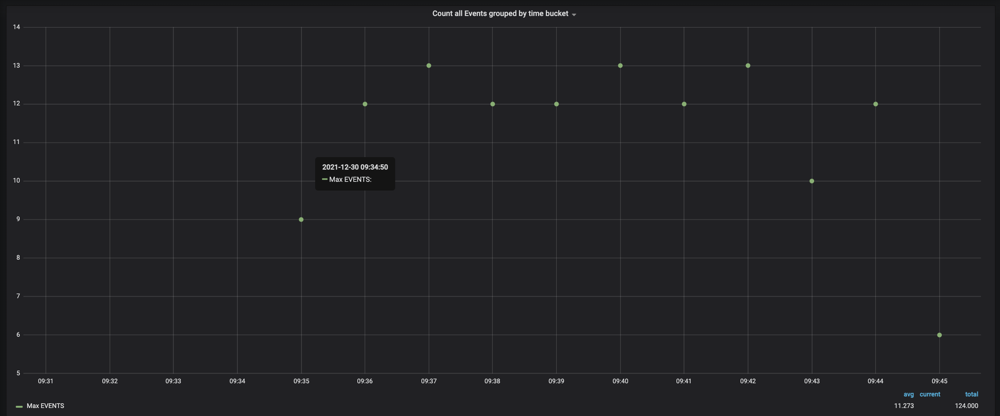

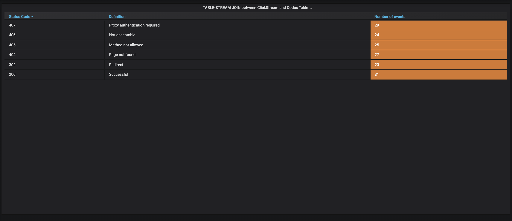

